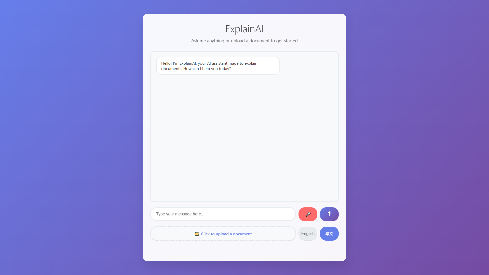

# Azure Translate App

This is a simple web application that uses Marian and Azure's AI foundry.

## Prerequisites

- Docker
- Docker-compose

## Running the application

To run the application, run the following command in the root of the project:

```bash
docker-compose up --build
```

Both containers are ready when these two snippets appear in the docker-compose logs:

### Flask
```bash
 * Serving Flask app 'app'
 * Debug mode: off
WARNING: This is a development server. Do not use it in a production deployment. Use a production WSGI server instead.
 * Running on http://127.0.0.1:5000
```


### Uvicorn
```bash
INFO:     Started server process [1111]   
INFO:     Waiting for application startup.
INFO:     Application startup complete.
INFO:     Uvicorn running on http://0.0.0.0:5004 (Press CTRL+C to quit)
```

## Accessing the application

Once both servers are running, you can access the webpage at ```127.0.0.1:5000``` or ```localhost:5000```.

